<div id="top-header" style="with:100%;height:auto;text-align:right;">
    
</div>

# INFRASTRUCTURE PLATFORM

# NGINX 1.28, PHP 8.3, POSTGRES 17.5

This Infrastructure Platform repository is designed for back-end projects and provides two separate platforms: one for the API and another for the database.

The goal of this structure is to offer developers a consistent framework for local development, mirroring real-world deployment scenarios. In production, the API may be deployed on an AWS EC2 / GCP GCE or  instance or distributed across Kubernetes pods, while the database would reside on an AWS RDS instance.

Additionally, this repository is independent of the API container code, allowing it to be developed in parallel with different API features. It can be configured with various platform settings tailored to the infrastructure or machine where it will be built and run — for example, adjusting container RAM usage, ports, and more.
<br>

## Content of this page:

- [Requirements](#requirements)
- [API service container settings](#api-settings)
- [Database service container settings](#db-settings)
- [Set up Docker Containers](#setup-containers)
- [Create Docker Containers](#create-containers)
- [GNU Make file recipes](#make-help)
- [Use this Platform Repository for REST API project](#platform-usage)
<br><br>

## <a id="requirements"></a>Requirements

Despite Docker’s cross-platform compatibility, for intermediate to advanced software development on environments other than Windows NT or macOS, automating the platform build and streamlining the process of starting feature development is crucial. This automation enables a more dynamic and efficient software development lifecycle.

- Docker
- Docker Compose
- GNU Make *(otherwise commands must be executed manually)*

| Dev machine   | Machine's features                                                                            |
| ------------- | --------------------------------------------------------------------------------------------- |
| CPU           | Linux *(x64 - x86)* /  MacOS Intel *(x64 - x86)*, or M1                                       |
| RAM           | *(for this container)*: 1 GB minimum.                                                         |
| DISK          | 2 GB *(though is much less, it usage could be incremented depending on the project usage)*.   |
<br>

## <a id="api-settings"></a>API service container settings

Inside `./platform/nginx-php` there are a dedicated GNU Make file and the main Docker directory with the required scripts and stack assets in the `./platform/nginx-php/docker/config` directory to build the required platform configuration. Also, there is a `config.sample` with alternate configuration files suggestions.

Content:
- Linux Alpine version 3.22
- NGINX version 1.28 *(or the latest on Alpine Package Keeper)*
- PHP FPM 8.3
<br>

<font color="orange"><b>IMPORTANT:</b></font> There is a `.env.example` file with the variables required to build the container by `docker-compose.yml` file to create the container if no GNU Make is available on developer's machine. Otherwise, it is not required to create its `.env` manually file for building the container.

API environment: `./platform/nginx-php/docker/.env`
```bash
COMPOSE_PROJECT_LEAD="myproj"
COMPOSE_PROJECT_CNET="mp-dev"
COMPOSE_PROJECT_IMGK="alpine3.21-nginx1.28-php8.3"
COMPOSE_PROJECT_NAME="mp-apirest-dev"
COMPOSE_PROJECT_HOST="127.0.0.1"
COMPOSE_PROJECT_PORT=7501
COMPOSE_PROJECT_PATH="../../../apirest"
COMPOSE_PROJECT_MEM="128M"
COMPOSE_PROJECT_SWAP="512M"
COMPOSE_PROJECT_USER="myproj"
COMPOSE_PROJECT_GROUP="myproj"
```

<div style="with:100%;height:auto;text-align:center;">
    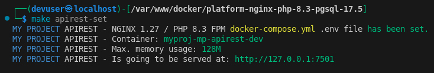
</div>
<br>

## <a id="db-settings"></a>Database service container settings

Inside `./platform/pgsql-17.5` there are a dedicated GNU Make file and the main Docker directory with the required scripts to build the required platform configuration adapted from [PostgreSQL GitHub repository source](https://github.com/docker-library/postgres/blob/master/17/alpine3.22/docker-entrypoint.sh)

Content:
- Linux Alpine version 3.22
- Postgres 17.5
<br>

<font color="orange"><b>IMPORTANT:</b></font> There is a `.env.example` file with the variables required to build the container by `docker-compose.yml` file to create the container if no GNU Make is available on developer's machine. Otherwise, it is not required to create its `.env` manually file for building the container.

Database environment: `./platform/pgsql-17.5/docker/.env`
```bash
COMPOSE_PROJECT_LEAD="myproj"
COMPOSE_PROJECT_CNET="mp-dev"
COMPOSE_PROJECT_IMGK="alpine3.22-pgsql-17.5"
COMPOSE_PROJECT_NAME="mp-pgsql-dev"
COMPOSE_PROJECT_HOST="127.0.0.1"
COMPOSE_PROJECT_PORT=7500
COMPOSE_PROJECT_MEM="128M"
COMPOSE_PROJECT_SWAP="512M"
POSTGRES_DATABASE=myproj_local
POSTGRES_USER=myproj
POSTGRES_PASSWORD="J4YPuJaieJ35gNAOSQQor87s82q2eUS1"
```

<div style="with:100%;height:auto;text-align:center;">
    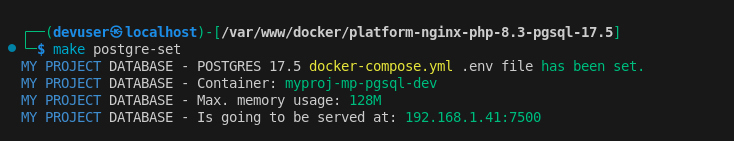
</div>
<br>

## <a id="setup-containers"></a>Configure Docker Containers

Create the root `./.env` file from the [./.env.example](./.env.example) and follow its description to configure the platforms. The end result would be like this:
```bash
SUDO=sudo
DOCKER=sudo docker
DOCKER_COMPOSE=sudo docker compose

PROJECT_NAME="MY PROJECT"
PROJECT_LEAD=myproj
PROJECT_HOST="127.0.0.1"
PROJECT_CNET=mp-dev

APIREST_PLTF=nginx-php
APIREST_IMGK=alpine3.21-nginx1.28-php8.3
APIREST_PORT=7501
APIREST_BIND="../../../apirest"
APIREST_CAAS=mp-apirest-dev
APIREST_CAAS_USER=myproj
APIREST_CAAS_GROUP=myproj
APIREST_CAAS_MEM=128M
APIREST_CAAS_SWAP=512M
APIREST_GIT_SSH=~/.ssh/id_rsa
APIREST_GIT_HOST=github.org
APIREST_GIT_BRANCH=develop
APIREST_DOMAIN=

DATABASE_PLTF=pgsql-17.5
DATABASE_IMGK=alpine3.22-pgsql-17.5
DATABASE_PORT=7500
DATABASE_CAAS=mp-pgsql-dev
DATABASE_CAAS_MEM=128M
DATABASE_CAAS_SWAP=512M
DATABASE_ROOT="sk5U2phvnjAMRe2wy0aD0ztCQaDusywp"
DATABASE_NAME=myproj_local
DATABASE_USER=myproj
DATABASE_PASS="J4YPuJaieJ35gNAOSQQor87s82q2eUS1"
DATABASE_PATH="/resources/database/"
DATABASE_INIT=pgsql-init.sql
DATABASE_BACK=pgsql-backup.sql
```

Once the environment file is set, create each Docker environment file by the automated commands using GNU Make:

Set up the API container
```bash
$ make apirest-set
```
<div style="with:100%;height:auto;text-align:center;">
    
</div>

Set up the database container
```bash
$ make postgres-set
```
<div style="with:100%;height:auto;text-align:center;">
    
</div>
<br>

Watch the local hostname IP on which Docker serves and the ports assigned, even though the API can be accessed through `http://127.0.0.1` or `http://localhost`
```bash
$ make local-hostname
```
<div style="with:100%;height:auto;text-align:center;">
    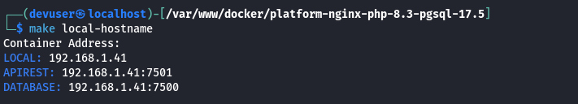
</div>
<br>

## <a id="create-containers"></a>Create and Start Docker Containers

Create and start up the API container
```bash
$ make apirest-create
```
<div style="with:100%;height:auto;text-align:center;">
    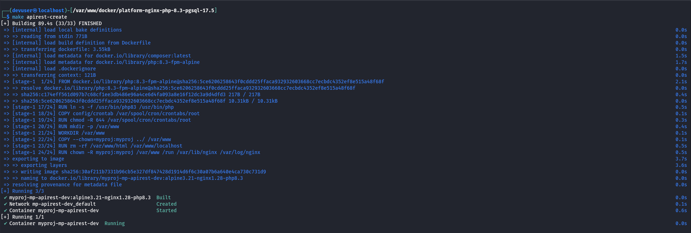
</div>
<br>

Testing container visiting localhost with the assigned port, but with no database connection established or failed because of wrong configuration
<div style="with:100%;height:auto;text-align:center;">
    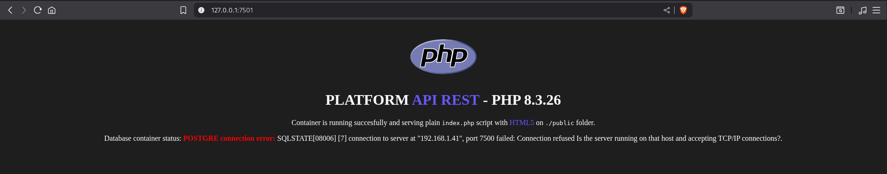
</div>
<br>

Create and start up the database container
```bash
$ make postgres-create
```
<div style="with:100%;height:auto;text-align:center;">
    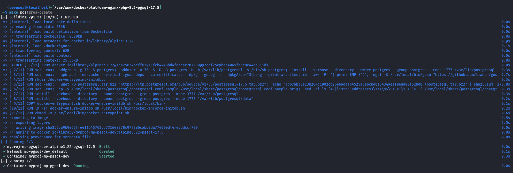
</div>
<br>

Testing container visiting localhost with the assigned port, and with a database connected
<div style="with:100%;height:auto;text-align:center;">
    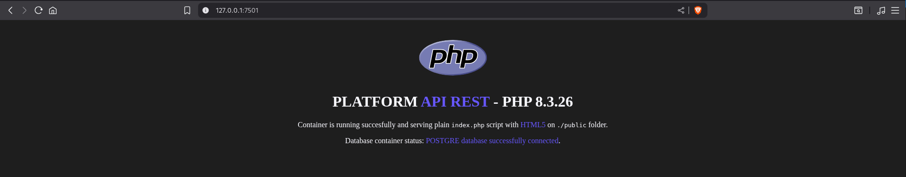
</div>
<br>

Docker information of both cointer up and running
<div style="with:100%;height:auto;text-align:center;">
    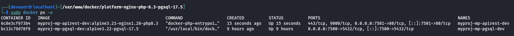
</div>
<div style="with:100%;height:auto;text-align:center;">
    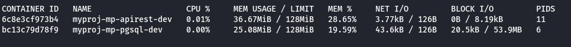
</div>
<br>

Despite each container can be stop or restarted, they can be stop and destroy both containers simultaneously to clean up locally from Docker generated cache, without affecting other containers running on the same machine.
```bash
$ yes | make apirest-destroy postgres-destroy
```
<div style="with:100%;height:auto;text-align:center;">
    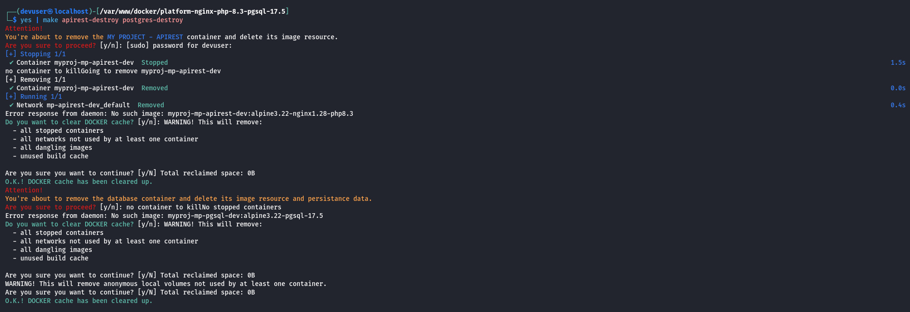
</div>
<br>

## <a id="make-help"></a>GNU Make file recipes

The project's main `./Makefile` contains recipes with the commands required to manage each platform's Makefile from the project root.

This streamlines the workflow for managing containers with mnemonic recipe names, avoiding the effort of remembering and typing each bash command line.

<div style="with:100%;height:auto;text-align:center;">
    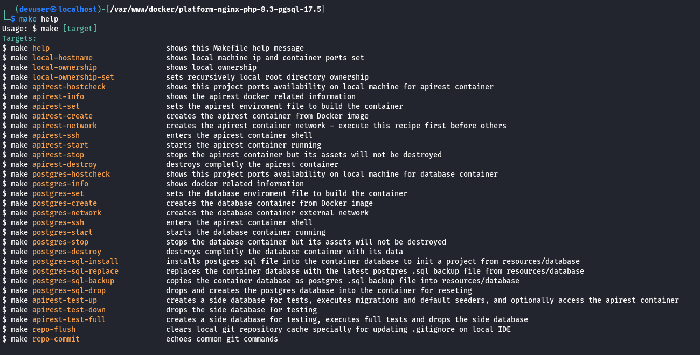
</div>
<br>

## <a id="platform-usage"></a>Use this Platform Repository for REST API project

Clone the platforms repository
```bash
$ git clone https://github.com/pabloripoll/docker-platform-nginx-php-8.3-pgsql-17.5
$ cd docker-platform-nginx-php-8.3-pgsql-17.5
```

Repository directories structure overview:
```
.
├── apirest (Symfony, Laravel, etc.)
│   ├── app
│   ├── bootstrap
│   ├── vendor
│   └── ...
│
├── platform
│   ├── nginx-php
│   │   ├── docker
│   │   │   ├── config
│   │   │   ├── .env
│   │   │   ├── docker-compose.yml
│   │   │   └── Dockerfile
│   │   │
│   │   └── Makefile
│   └── postgres-17.5
│       ├── docker
│       └── Makefile
├── .env
├── Makefile
└── README.md
```
<br>

Set up platforms
- Copy `.env.example` to `.env` and adjust settings (apirest port, database port, container RAM usage, etc.)
- By configuring the PHPcontainer with e.g. `APIREST_CAAS_MEM=128M`, remember to set the same RAM value into `./platform/nginx-php/docker/config/php/php.ini`
<br><br>

Generate the environment for each platform
```bash
$ make apirest-set postgres-set
```
<br>

Create platforms containers
```bash
$ make apirest-create postgres-create
```
<br>

Remove default Nginx-PHP platform API content
```bash
$ git rm -r ./apirest
$ git clean -fd
$ git reset --hard
$ rm -rfv ./apirest/*
$ rm -rfv ./apirest/.*
```

Now `./apirest` directory can be used to install any other REST API repository

> **Note**: Most probably it would be needed to update root `.gitignore` file to ignore the REST API one.

<br>

---

## Contributing

Contributions are very welcome! Please open issues or submit PRs for improvements, new features, or bug fixes.

1. Fork the repository
2. Create your feature branch (`git checkout -b feature/YourFeature`)
3. Commit your changes (`git commit -am 'feat: Add new feature'`)
4. Push to the branch (`git push origin feature/YourFeature`)
5. Create a new Pull Request

---

## License

This project is open-sourced under the [MIT license](LICENSE).

<!-- FOOTER -->
<br>

---

<br>

- [GO TOP ⮙](#top-header)

<div style="with:100%;height:auto;text-align:right;">
    
</div>